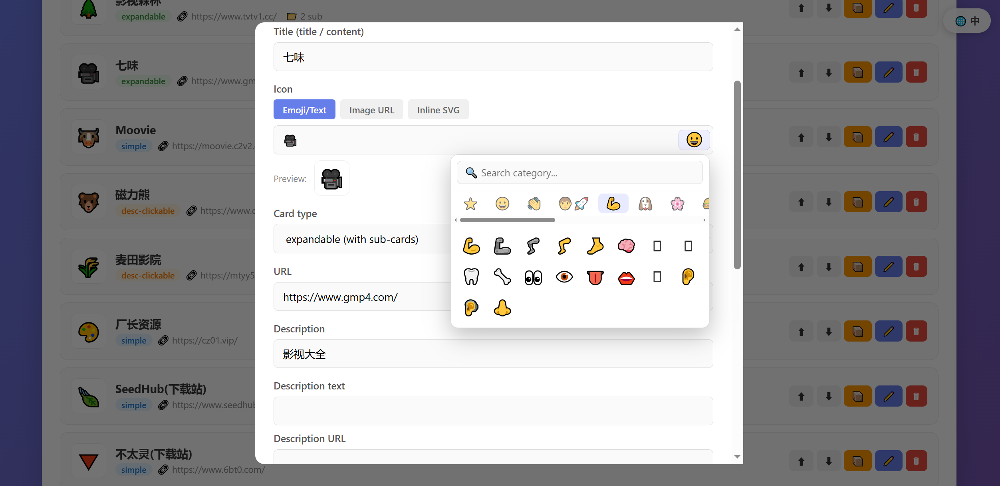
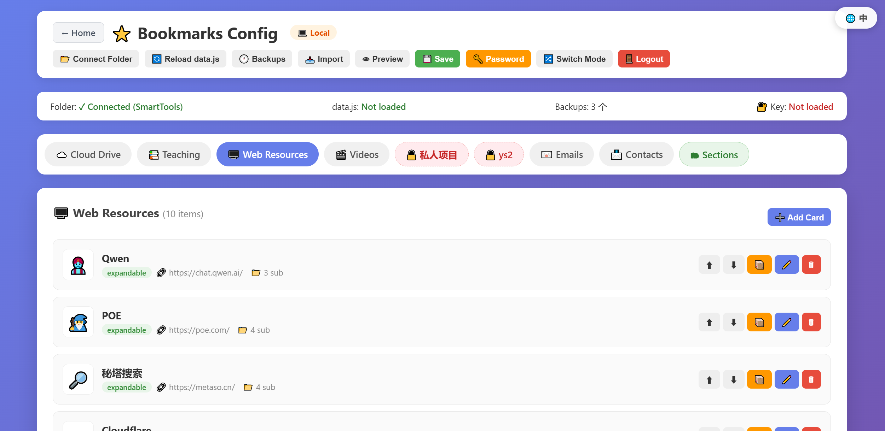

# SmartTools - 可编辑的在线收藏夹与分享系统

> 🌏 [ENGLISH README](./README.md)

SmartTools 是一个可自托管的收藏夹仪表盘，用来管理个人网址、常用工具、Markdown 笔记和轻量协作分享。

它既可以作为纯静态站点运行，也可以部署为 Cloudflare Pages + Functions 应用，获得在线编辑、多用户、公开短链、收件箱分享、版本备份和浏览器标签页导入等能力。

---

## ✨ 核心特性

### 📚 收藏夹主页

- **多种卡片样式**：整卡跳转（`simple`）、描述可点击（`desc-clickable`）、可展开分组（`expandable`，支持子卡片）。
- **丰富图标支持**：Emoji、文字、图片 URL、内联 SVG 均可使用。
- **可视化后台**：卡片、子卡片、分类均可在浏览器中增删改、拖动排序、跨分类移动。
- **自定义大类**：支持新增、重命名、排序、隐藏，并设置移动端展开/折叠行为。
- **五套内置主题**：Nebula、Notion、Stripe、Dark、Mint，对应 `index1.html` - `index5.html`。
- **站点基础设置**：可在后台配置标题、页眉、页脚、默认主题、自动备份、备份保留数量、删除二次确认等。

### 🔐 隐私与笔记

- **加密大类**：任意自定义分类可在浏览器本地使用 AES-GCM 加密，服务端和仓库只保存密文。
- **隐藏标题**：加密大类锁定时连真实标题也会隐藏，只显示一个低调的解锁入口。
- **会话级解锁**：解锁态只保存在当前标签页 `sessionStorage`，关闭标签页自动锁定；右下角可一键立即锁定。
- **Markdown 卡片注释**：任意主卡片或子卡片可保存 Markdown 注释，支持常用语法、工具栏和快捷键。
- **加密笔记**：加密大类中的注释会随卡片一起加密保存，解锁后才可见。

### 👥 多用户与分享

- **管理员 + 普通用户**：管理员可创建用户、重置密码、禁用/删除账号，并管理用户数据边界。
- **用户数据隔离**：管理员和每个普通用户拥有独立的数据、数据源设置和备份命名空间。
- **公开短链**：用户可启用公开 slug，例如 `/u/alice` 或 `?u=alice`；公开响应会过滤私密/加密分类。
- **Slug 安全机制**：保留词、唯一性校验、旧 slug 重定向、失败访问 IP 限速，减少冲突和枚举风险。
- **收件箱分享**：用户之间可发送卡片，附带简短 Markdown 留言；发件方可查看发送历史。
- **管理员推送**：管理员可向指定用户推送卡片，既可进入对方收件箱待确认，也可强制直写并显示推送标记。
- **加密接收流程**：来自加密来源的卡片只能被接收到加密大类，避免隐私边界被绕过。

### 🧰 数据管理

- **双模式部署**：
  - ☁️ **在线模式**：Cloudflare Pages Functions + KV，登录后可跨设备编辑。
  - 💻 **本地模式**：Chrome/Edge 通过 File System Access API 直接读写本地 `data.js`。
- **数据源切换**：在线模式可在 KV 实时数据与仓库静态 `data.js` 之间切换。
- **自动回退**：KV 数据缺失时，可回退到静态 `data.js` 或首次使用空白模板。
- **版本备份与恢复**：每个命名空间拥有独立备份，可列表、预览、恢复、下载和按保留策略清理。
- **永久归档**：强制删除用户前会归档数据、数据源和备份；管理员可查看、下载、删除归档。
- **大数据分片存储**：后端支持按分类写入 KV 分片，同时仍可重建标准 `data.js`。
- **迁移工具**：`/api/migrate-v2` 可将旧 KV 键安全、幂等地迁移到新的 `admin:*` 命名空间。

### 🧩 浏览器扩展

`extensions/open-tabs-importer` 提供 Chrome/Edge 标签页导入能力：

- 将当前窗口或所有窗口的标签页发送到 SmartTools 后台确认导入。
- 可复制为 JSON 或普通文本；文本模式支持默认只复制 URL。
- 可下载为浏览器兼容的 HTML 书签文件，或 SmartTools 可继续处理的 JSON 文件。
- 可打开配置的后台地址，也可去掉后台路径后打开站点主页。
- 自动跳过非 HTTP(S) 标签和 SmartTools 后台页。
- 在后台确认界面勾选需要导入的标签。
- 可新建可展开父卡片，也可追加到已有可展开父卡片。
- 保存标题、URL，以及可用的非 base64 favicon 地址。
- 如果后台页尚未打开，扩展会自动打开后台，并在后台界面准备好后投递待导入标签。

---

## 🚀 快速开始

### 方式一：Cloudflare Pages（推荐）

1. Fork 或导入本仓库。
2. 在 Cloudflare Dashboard 进入 **Workers & Pages → Create application → Pages → Connect to Git**。
3. 构建设置保持默认：

| 设置项 | 值 |
|---|---|
| Build command | 留空 |
| Build output directory | `/` |

首次部署完成后，先配置环境变量和 KV，再访问使用。

### 必需环境变量

在 **Project → Settings → Environment variables → Production** 添加以下变量，建议全部设为加密 Secret：

| 变量名 | 必填 | 说明 |
|---|---|---|
| `ADMIN_USER` | ✅ | 初始管理员用户名 |
| `ADMIN_PASS` | ✅ | 初始管理员密码 |
| `AUTH_SECRET` | ✅ | 登录 Cookie 的 HMAC 签名密钥 |

生成强 `AUTH_SECRET`：

```bash
openssl rand -base64 48
```

或使用 Node.js：

```bash
node -e "console.log(require('crypto').randomBytes(48).toString('base64'))"
```

### 绑定 KV

创建 KV 命名空间，并绑定到 Pages 项目：

| Variable name | KV namespace |
|---|---|
| `FAV_KV` | 你的 SmartTools KV 命名空间 |

绑定变量名必须严格为 `FAV_KV`。

### 首次登录

1. 配置变量和 KV 后重新部署 Pages 项目。
2. 打开 `https://<你的项目>.pages.dev/config.html`。
3. 使用 `ADMIN_USER` / `ADMIN_PASS` 登录。
4. 在后台保存一次，初始化 KV 数据。

### 方式二：本地模式

1. 克隆或下载本仓库。
2. 在目录内启动本地服务，例如：

```bash
python -m http.server
```

3. 用 Chrome 或 Edge 打开 `http://localhost:8000/config.html`。
4. 选择本地模式，创建本地凭据，连接项目文件夹，即可直接编辑 `data.js`。

### 方式三：纯静态只读

手动编辑 `data.js` 并部署到任意静态托管平台即可，不需要开放 `config.html`。

---

## 🌐 公开链接

用户可在后台启用公开 slug。

示例：

```text
/u/alice
/u/alice?theme=stripe
/index2.html?u=alice
```

公开响应会在返回数据前过滤私密/加密分类。slug 改名后，旧 slug 可在一定时间内重定向到新 slug。

---

## 🧩 扩展使用

未打包扩展目录为 `extensions/open-tabs-importer`。

1. 打开 Chrome/Edge 扩展管理页。
2. 开启开发者模式。
3. 加载 `extensions/open-tabs-importer` 作为未打包扩展。
4. 点击扩展图标，确认 SmartTools 后台地址。
5. 使用「打开后台」进入 `config.html`，或用「打开主页」进入站点根地址。
6. 在「发送标签到后台确认导入」中选择当前窗口或所有窗口标签页。
7. 在 SmartTools 后台确认标签、所属分类和父卡片方式，然后保存。

同一个弹窗也支持复制为 JSON/文本，或下载为 HTML/JSON 书签文件。

仓库也包含已打包文件：`extensions/open-tabs-importer.zip`。

---

## 📁 目录结构

```text
/
├── index.html              # 默认入口页
├── index1.html             # Nebula 主题
├── index2.html             # Notion 主题
├── index3.html             # Stripe 主题
├── index4.html             # Dark 主题
├── index5.html             # Mint 主题
├── config.html             # 后台与本地模式编辑器
├── data.js                 # 静态回退 / 只读数据
├── shared/                 # 前端共享模块
│   ├── data-loader.js
│   ├── enc-unlock.js
│   ├── enc-rerender.js
│   ├── fav-page.js
│   ├── note-modal.js
│   ├── zip-adapter.js
│   └── xlsx-adapter.js
├── functions/              # Cloudflare Pages Functions
│   ├── _shared/            # 鉴权、slug、数据分片、元数据工具
│   ├── api/                # JSON API
│   └── u/[[slug]].js       # /u/<slug> 公开访问路由
├── extensions/
│   └── open-tabs-importer/ # Chrome/Edge 标签页导入扩展
├── scripts/
│   └── update-timestamp.js
├── screenshot/
└── README.md
```

---

## 🎨 卡片类型

| 类型 | 用途 |
|---|---|
| `simple` | 整张卡片打开一个 URL |
| `desc-clickable` | 标题/卡片打开 `url`，描述打开 `descUrl` |
| `expandable` | 父卡片展开显示 `subCards` |

子卡片支持两行式（`icon`、`title`、`desc`、`url`）和紧凑式（`icon`、`content`、`url`）。

---

## 🧩 API 参考

### 会话与账号

| 方法 | 路径 | 鉴权 | 说明 |
|---|---|---|---|
| `POST` | `/api/login` | 否 | 使用管理员或 KV 用户登录 |
| `POST` | `/api/logout` | 否 | 清除登录 Cookie |
| `GET` | `/api/check` | 否 | 会话状态、角色、KV/Admin 配置、迁移提示 |
| `POST` | `/api/change-password` | 是 | 当前用户修改自己的密码 |
| `GET/POST/DELETE` | `/api/users` | 管理员 | 用户列表、创建/重置、归档/删除 |

### 数据与配置

| 方法 | 路径 | 鉴权 | 说明 |
|---|---|---|---|
| `GET` | `/api/data` | 否 | 读取当前 `data.js`，支持 `format=json`、`source=kv/static`、`u=<slug>` |
| `GET` | `/api/data-meta` | 否 | 轻量版本、哈希、ETag 元数据 |
| `POST` | `/api/save` | 是 | 保存完整数据或分类级增量 |
| `POST` | `/api/comment` | 是 | 精准修改单张卡片注释，或移除推送标记 |
| `GET/POST` | `/api/source` | GET 公开，POST 登录 | 读取或切换数据源 |
| `GET/POST` | `/api/site-config` | GET 公开，POST 登录 | 读取或保存站点标题、主题、备份设置 |

### 分享与发布

| 方法 | 路径 | 鉴权 | 说明 |
|---|---|---|---|
| `GET/POST/DELETE` | `/api/public-slug` | 是 | 管理公开 slug |
| `GET/POST` | `/api/inbox` | 是 | 收件箱列表、接收、拒绝、删除、发送、策略设置 |
| `POST` | `/api/push` | 管理员 | 向指定用户推送卡片，进入收件箱或强制写入 |
| `GET` | `/u/<slug>` | 否 | 公开主题页面路由 |

### 备份、归档、迁移

| 方法 | 路径 | 鉴权 | 说明 |
|---|---|---|---|
| `GET/POST/DELETE` | `/api/backups` | 是 | 列表、创建、预览、恢复、删除备份 |
| `GET/DELETE` | `/api/archives` | 管理员 | 列表、下载、删除用户永久归档 |
| `POST` | `/api/migrate-v2` | 管理员 | 迁移旧 KV 键到 `admin:*` 命名空间 |

---

## 🔑 鉴权机制

- 会话使用 `auth` Cookie。
- Token 使用 `AUTH_SECRET` 进行 HMAC-SHA256 签名。
- Cookie 属性为 `HttpOnly; Secure; SameSite=Strict; Max-Age=604800`。
- KV 用户密码使用 PBKDF2-SHA256 + 独立盐存储。
- 老 SHA-256 用户哈希仍可读取，并会在成功登录或改密时升级。
- 登录失败按客户端 IP 限速。

---

## 🔄 数据模型说明

当前数据格式：

```js
var sections = [
  { key: 'usbDriveData', kind: 'card', label: '...', cards: [] }
];
```

旧格式的顶层数组（如 `var usbDriveData = []`）仍由迁移和合并路径兼容。

重要 KV 命名空间：

| Key 形式 | 含义 |
|---|---|
| `admin:data_js` | 管理员收藏数据 |
| `admin:data_source` | 管理员数据源设置 |
| `admin:backup:<timestamp>` | 管理员备份 |
| `user:<uid>:data_js` | 用户收藏数据 |
| `user:<uid>:data_source` | 用户数据源设置 |
| `user:<uid>:backup:<timestamp>` | 用户备份 |
| `users` | 用户表与公开 slug 设置 |
| `inbox:<uid>:<msgId>` | 收件箱消息 |
| `archive:<uid>:<timestamp>:*` | 永久删除归档 |

---

## 🖼 截图

### 收藏夹主页


### 配置后台





---

## 📱 兼容性

- **收藏夹页面**：现代 Chrome、Edge、Firefox、Safari 和移动端浏览器。
- **在线后台**：现代浏览器。
- **本地模式**：Chrome 86+ 或 Edge 86+，必须通过 `http://` 或 `https://` 访问；不支持 `file://`。
- **浏览器扩展**：支持 Manifest V3 的 Chromium 系 Chrome/Edge。

---

## 🛡️ 安全建议

1. 设置强 `AUTH_SECRET`，不要使用可预测值。
2. 管理员和普通用户都应使用强密码。
3. 将 `ADMIN_USER`、`ADMIN_PASS`、`AUTH_SECRET` 设为 Cloudflare 加密 Secret。
4. 保持 Cloudflare Pages HTTPS 开启。
5. 若后台用于敏感场景，建议额外加 Cloudflare Access / Zero Trust。
6. 加密大类请使用独立密码并保存到密码管理器；忘记后无法恢复。
7. 不要在普通卡片注释中保存密码、Token 等敏感信息；敏感短文本请放入加密大类。
8. 启用公开 slug 后，请检查公开页面，确认没有不应公开的分类。

---

## 🔒 隐私说明

- 在线数据保存在你自己的 Cloudflare KV 命名空间。
- 本地模式的数据和凭据只保存在本机。
- 公开页面返回数据前会过滤私密/加密分类。
- 浏览器扩展只读取标签页元数据，并发送到你自己已登录的 SmartTools 后台。

---

## ❓ 常见问题

**Q1：后台保存后，前台没有变化？**
检查 `FAV_KV` 是否正确绑定，以及当前数据源是否为 `kv`。

**Q2：登录提示环境变量缺失？**
确认 Production 环境已配置 `ADMIN_USER`、`ADMIN_PASS`、`AUTH_SECRET`，然后重新部署。

**Q3：刷新后又要重新登录？**
通常是 `AUTH_SECRET` 发生变化或未一致生效。保持密钥稳定并重新部署。

**Q4：如何用 Cloudflare Functions 本地开发？**

```bash
npm i -g wrangler
wrangler pages dev . --kv FAV_KV
```

本地环境变量可放在 `.dev.vars`。

**Q5：如何备份数据？**
使用后台备份/导出工具，或访问 `/api/data?format=json`，将返回的 `content` 保存为 `data.js`。

---

## 📝 License

MIT License

---

## 🙏 致谢

- 基于 [Cloudflare Pages](https://pages.cloudflare.com/) 与 [Workers KV](https://developers.cloudflare.com/kv/) 托管。
- 部分图标来自 Emoji 与各站点官方 Logo。

---

> 如果这个项目对你有帮助，欢迎 Star ⭐️
