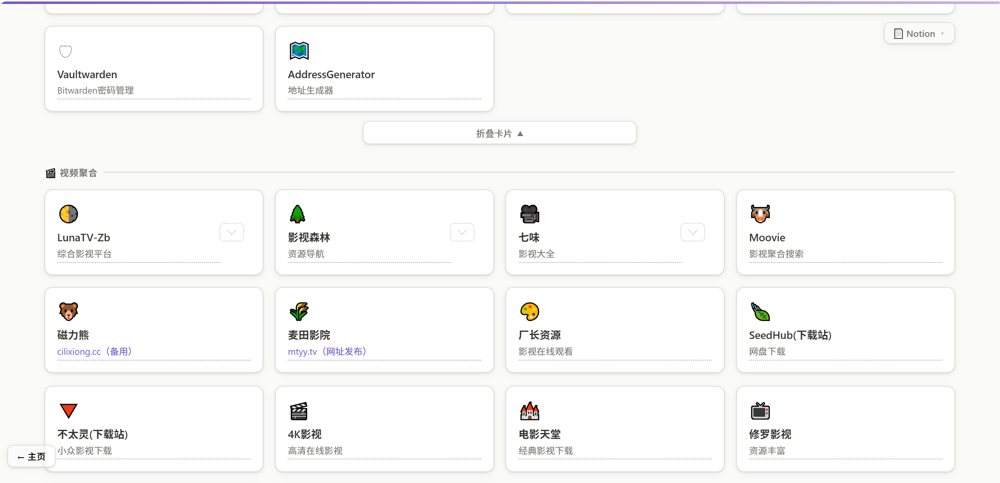
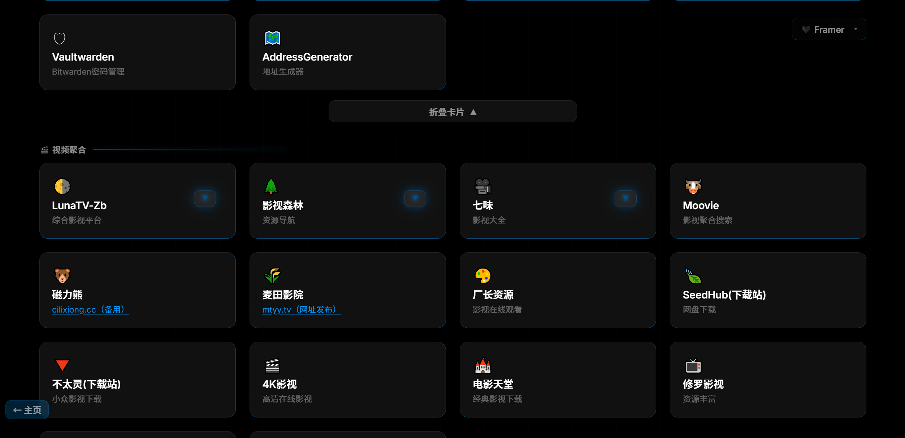
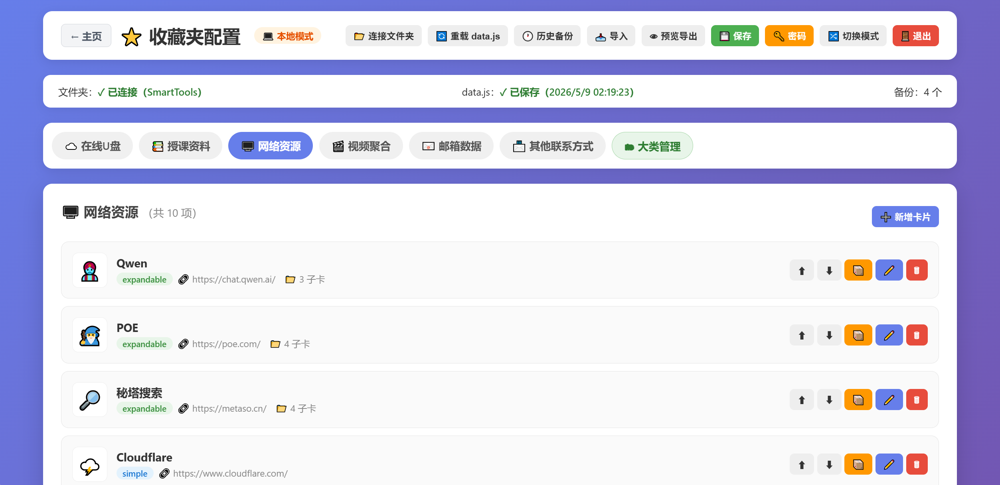
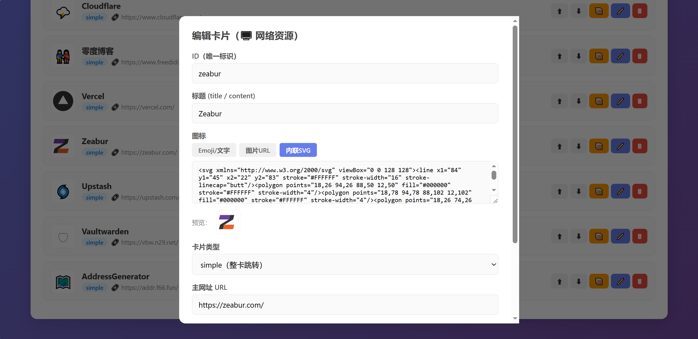

# SmartTools - 可编辑的在线收藏夹系统

> 🌏 [ENGLISH README](./README.md)

一个**支持多种卡片样式、可视化配置、双模式部署**的个人收藏夹系统，内置若干自用小工具作为其中一个栏目。

最初只是用来存放随手写给自家小朋友的一些在线小工具，后来逐步演变成了现在这个**在线收藏夹系统**，小工具作为其中一栏。
收藏的网址、书签、常用工具都可以通过 Web 界面直接编辑，**无需改代码、无需重新部署**。

---

## ✨ 核心特性

### 📚 收藏夹系统

- **多种卡片样式**：整卡跳转（simple）、描述可点击（desc-clickable）、可展开子菜单（expandable，带多级子卡片）
- **丰富的图标支持**：Emoji / 文字 / 图片 URL / 内联 SVG 任选
- **可视化配置后台**：所有卡片、子卡片、分类均可通过网页直接增删改、拖动排序、跨分类移动
- **自定义大类**：除内置的「在线U盘、授课资料、网络资源、视频聚合、邮箱、其他联系方式」之外，可自由新增/删除/重命名/排序自定义分类，并可设置手机端展开折叠行为
- **🔐 加密大类（隐私保护）**：任意自定义大类均可一键开启加密，内容使用 **AES-GCM 256 位** 在浏览器本地加密后再存入 `data.js`，服务端和仓库中只留密文；访问时需输入独立密码解锁，密码正确才会在内存中解密渲染。解锁状态仅保留在当前标签页的 `sessionStorage` 中，关闭标签页即自动锁定；页面右下角还提供浮动「立即锁定」按钮，可随时一键清除解锁态。锁定状态下连大类标题都会隐藏，只显示一个不起眼的小药丸入口，**即使 `data.js` 被公开到 GitHub 也无法反推出内容**
- **双模式部署**：
  - ☁️ **在线模式**：部署到 Cloudflare Pages，数据存于 KV，任何设备/浏览器都可登录编辑
  - 💻 **本地模式**：浏览器直接读写本地 `data.js` 文件（基于 File System Access API，需 Chrome / Edge）
- **版本管理**：每次保存自动备份旧版本，支持预览、下载、一键恢复任意历史版本
- **数据源切换**：在线模式下可一键在「KV 实时数据」与「GitHub 仓库静态 `data.js`」之间切换，切换即时生效
- **自动回退**：选择 KV 数据源但 KV 中暂无数据时，自动回退读取仓库内的静态 `data.js`，不会出现空白页面
- **导入 / 导出**：支持从任意 `data.js` 文件导入，也可随时预览或下载当前数据
- **安全机制**：在线模式使用 HttpOnly Cookie + HMAC-SHA256 签名令牌会话；本地模式凭据经 SHA-256 哈希后存储于浏览器

### 🧰 自用小工具栏目

这是最早起步时为自家小朋友日常学习随手写的一些在线小工具，现在作为收藏夹的一个栏目保留下来（在主页顶部可直接进入）。所有工具均为响应式设计，打开即用，无需安装：

- **估算计算器**：训练加减乘除估算能力，提供首位估算法、整十数法、次位取整法等多种方法，显示详细步骤并对比精确结果，帮助孩子系统掌握数学估算技巧
- **诗词九宫格**：通过九宫格游戏帮助孩子记忆古诗词，内置 1-6 年级上下册诗词库（每周一首），支持随机诗词（接入今日诗词 API）与自定义输入，寓教于乐
- **每日数学练习**：自动生成小学口算、竖式、脱式、应用题，含完整答案与解题步骤，打印友好，方便日常练习
- **AI 错题本**：拍照识别题目 → AI 自动解析 → 生成同类变式题；多科目管理、知识点自动标签、PWA 离线、支持 Gemini / OpenAI 接口，让错题真正变成提分利器
- **生理学知识点大纲**：系统整理人体生理学 12 个核心章节的四级知识点结构，配临床应用实例与疾病对照说明，适合医学生和医护人员参考学习
- **密码管理器**：纯本地运算的密码生成工具，支持自定义长度与字符组合，实时评估密码强度，不上传任何数据
- **影视聚合**：基于 [MoonTV](https://github.com/gagabba/MoonTV-gas) 的无服务器影视聚合播放器，多源搜索、在线播放、自动去广告、收藏云同步

---

## 🚀 快速开始

### 方式一：Cloudflare Pages 部署（推荐，可在线编辑）

#### 1. Fork / 导入仓库

1. Fork 本仓库到你的 GitHub 账号
2. 登录 [Cloudflare Dashboard](https://dash.cloudflare.com) → **Workers & Pages** → **Create application** → **Pages** → **Connect to Git**，选择该仓库
3. 构建设置保持默认（纯静态 + Functions，无需构建命令）：
   - Build command: *留空*
   - Build output directory: `/`

首次部署完成后**先不要急着访问**，还需要完成下面的环境变量和 KV 绑定。

#### 2. 配置环境变量

进入 **项目 → Settings → Environment variables → Production**，添加以下 **3 个变量**（建议全部勾选 **Encrypt / Secret**）：

| 变量名 | 必填 | 示例值 | 说明 |
|---|---|---|---|
| `ADMIN_USER` | ✅ | `admin` | 后台登录用户名 |
| `ADMIN_PASS` | ✅ | `YourStrongPassword!2026` | 后台登录密码，请使用强密码 |
| `AUTH_SECRET` | ✅ | *（见下方生成命令）* | 用于对登录 Cookie 进行 HMAC-SHA256 签名的密钥 |

> ⚠️ **`AUTH_SECRET` 必须修改！**
> ~~代码里有一个兜底默认值 `please-change-this-secret`，如果你忘了配置，系统依然能运行，但签名密钥是公开字符串，**任何人都可以伪造登录态**。~~

推荐的密钥生成方式（任选其一）：

```bash
# macOS / Linux
openssl rand -base64 48

# Node.js
node -e "console.log(require('crypto').randomBytes(48).toString('base64'))"

# Python
python3 -c "import secrets; print(secrets.token_urlsafe(48))"
```

将生成出的随机字符串（至少 32 位）整串粘贴到 `AUTH_SECRET` 即可。

#### 3. 创建并绑定 KV 命名空间

**3.1 创建 KV 命名空间**

进入 **Workers & Pages → KV → Create a namespace**，名字随意，例如 `smarttools-fav`。

**3.2 绑定到 Pages 项目**

回到 Pages 项目 → **Settings → Functions → KV namespace bindings → Add binding**：

| Variable name | KV namespace |
|---|---|
| **`FAV_KV`** | 选择上一步创建的命名空间 |

> ⚠️ **Variable name 必须严格写成 `FAV_KV`**（大写、下划线）。
> 代码里通过 `env.FAV_KV` 访问该 KV，写错名字会导致保存功能失效，并自动回退为只读状态。

**3.3 KV 中的 Key 说明**（无需手动创建，系统会自动写入）

| Key | 类型 | 说明 |
|---|---|---|
| `data_js` | 文本 | 完整的 `data.js` 内容（所有收藏数据） |
| `data_source` | `kv` / `static` | 数据源开关，决定前台读取哪边 |

#### 4. 触发重新部署

完成环境变量和 KV 绑定后，进入 **Deployments → 最新一次部署 → Retry deployment**，让新配置生效。

#### 5. 首次登录与初始化

1. 打开你的站点：`https://<你的项目名>.pages.dev`
2. 访问 `/config.html`，用 `ADMIN_USER` / `ADMIN_PASS` 登录
3. 编辑内容并点击**保存**
4. 保存成功后，KV 中的 `data_js` 被写入，前台开始从 KV 读取数据

---

### 方式二：本地模式（零后端，纯静态）

1. 克隆或下载本仓库到本地
2. 用 **Chrome / Edge** 打开 `index.html`（建议用任意本地服务器，如 `python -m http.server`，不要用 `file://`）
3. 访问 `config.html`，选择「💻 本地模式」
4. 首次使用时设置用户名密码（哈希后仅存于当前浏览器）
5. 点击「📂 连接文件夹」并选中仓库所在目录，即可直接编辑本地 `data.js`

### 方式三：纯静态只读

如果只想展示而不想编辑，直接手动修改 `data.js` 并部署到任意静态托管平台（GitHub Pages / Vercel / Netlify 等）即可，`config.html` 可以不访问也不开放。

---

## 🔄 数据源切换机制

在线模式下系统支持两种数据源，由 KV 中的 `data_source` 键控制：

| 取值 | 前台数据来源 | 适用场景 |
|---|---|---|
| `kv`（默认推荐） | KV 中的 `data_js` | 日常使用，后台保存即生效 |
| `static` | 仓库里的 `data.js` | 紧急回滚 / 调试 / 只读展示 |

在 `config.html` 顶部可一键切换，也可通过预览参数临时查看：

```
/api/data?format=json                 # 查看当前实际生效的内容
/api/data?format=json&source=kv       # 强制预览 KV 版本
/api/data?format=json&source=static   # 强制预览仓库静态版本
```

**自动回退规则**：当选择 `kv` 但 KV 里为空时，系统会自动回退读取仓库里的 `data.js`，响应头标注 `X-Data-Source: static-fallback`，不会出现空白页面。

---

## 🔑 鉴权机制说明（在线模式）

- 登录成功后服务端签发一个令牌，写入名为 `auth` 的 Cookie
- 令牌格式：`base64url(payload).base64url(HMAC-SHA256(payload, AUTH_SECRET))`
- Payload：`{ "u": "<username>", "exp": <毫秒时间戳> }`
- Cookie 属性：`HttpOnly; Secure; SameSite=Strict; Max-Age=604800`（7 天）
- 每次访问需要鉴权的接口时，服务端会：
  1. 从 Cookie 读取 `auth`
  2. 用 `AUTH_SECRET` 重新计算签名比对
  3. 校验 `exp` 是否过期
  4. 通过则放行，否则返回 `401`

---

## 📁 目录结构

```
/
├── index.html              # 收藏夹主页
├── login.html              # 登录页
├── config.html             # 配置后台（支持在线/本地双模式）
├── data.js                 # 静态数据文件（KV 为空时的回退）
├── functions/              # Cloudflare Pages Functions（在线模式 API）
│   ├── _shared/
│   │   └── auth.js         # 鉴权工具（签发 / 校验令牌）
│   └── api/
│       ├── login.js        # POST /api/login
│       ├── logout.js       # POST /api/logout
│       ├── data.js         # GET  /api/data
│       ├── save.js         # POST /api/save
│       ├── source.js       # GET/POST /api/source
│       └── backups.js      # 历史版本管理
├── scripts/
│   └── update-timestamp.js         # 更新data.js时间戳的小工具
├── tools/                  # 自用小工具
│   ├── font/         # 小工具使用的字体
│   ├── ydyjsq.html       # 估算计算器
│   ├── 9gg3.html         # 诗词九宫格
│   ├── math3.html        # 三年级每日数学练习
│   ├── math3-4.html     # 三进四每日数学练习
│   └── slxzsd.html           # 生理学知识点大纲
└── README.md
```

> 以 `_` 开头的目录不会被 Pages 当作路由，用来存放共享模块。

---

## 🎨 卡片类型说明

| 类型 | 用途 | 示例 |
|------|------|------|
| `simple` | 整卡可点击跳转 | 常规网址收藏 |
| `desc-clickable` | 主标题跳 A，描述文字跳 B | 「GitHub」→ 主页，描述「我的仓库」→ 仓库页 |
| `expandable` | 展开后显示多个子卡片 | 分组类：如「AI 工具合集」下挂多个 AI 站点 |

子卡片还支持两种样式：**两行式**（图标 + 标题 + 描述）和 **紧凑式**（图标 + 单行内容）。

---

## 🧩 API 参考（在线模式）

| 方法 | 路径 | 鉴权 | 说明 |
|---|---|---|---|
| `POST` | `/api/login` | 否 | 登录，body: `{username, password}` |
| `POST` | `/api/logout` | 否 | 退出登录，清除 Cookie |
| `GET`  | `/api/data` | 否 | 返回 `data.js` 文本，`?format=json` 返回 JSON |
| `POST` | `/api/save` | 是 | 保存数据到 KV，body: `{content}` |
| `GET`  | `/api/source` | 是 | 读取当前数据源设置 |
| `POST` | `/api/source` | 是 | 切换数据源，body: `{source: "kv" \| "static"}` |
| `GET`  | `/api/backups` | 是 | 历史版本列表 / 预览 / 恢复 |

---

## 🖼 截图

### 收藏夹主页



### 配置后台


### 卡片编辑


---

## 📱 兼容性

- **收藏夹主页**：所有现代浏览器（Chrome / Edge / Firefox / Safari / 移动端），响应式设计适配手机、平板、桌面
- **配置后台（在线模式）**：所有现代浏览器
- **配置后台（本地模式）**：需 **Chrome 86+ / Edge 86+**（依赖 File System Access API），且必须通过 `http://` 或 `https://` 访问（不支持 `file://`）

---

## 🛡️ 安全建议

1. **务必设置强 `AUTH_SECRET`**，不要使用默认值
2. **使用强密码**作为 `ADMIN_PASS`，不要与其他站点复用
3. 将 `ADMIN_USER` / `ADMIN_PASS` / `AUTH_SECRET` 全部设为 **Secret**（加密）类型
4. Cloudflare Pages 默认全站 HTTPS，不要关闭
5. 如需多人使用，建议在 Cloudflare 前面再加一层 **Access / Zero Trust** 访问策略
6. 定期轮换 `AUTH_SECRET`（注意轮换后所有已登录设备需要重新登录）
7. **加密大类密码请独立设置，切勿与登录密码复用**：加密采用 PBKDF2（SHA-256, 250,000 轮）派生密钥 + AES-GCM 加密，强度取决于你设置的密码。一旦遗忘，**任何人（包括作者）都无法恢复数据**，建议妥善保存到密码管理器中

---

## 🔒 隐私说明

- **在线模式**：所有数据存储于你自己的 Cloudflare KV 账号内，不经过任何第三方服务器
- **本地模式**：数据和密码完全保存在本地设备，不上传任何信息
- **内置小工具**（密码管理器、估算计算器等）：均为纯前端运算，不发送任何数据到服务器
- AI 错题本调用的是你自己配置的 Gemini / OpenAI API Key，请求不经过本站

---

## ❓ 常见问题

**Q1：后台保存后，前台没变化？**
A：检查 KV 绑定的 Variable name 是否为 `FAV_KV`（严格区分大小写），以及 `config.html` 中数据源是否切换到了 `kv`。

**Q2：登录时提示"服务端未配置 ADMIN_USER / ADMIN_PASS 环境变量"？**
A：去 Pages → Settings → Environment variables 确认变量已添加到 **Production** 环境，并**重新触发一次部署**让其生效。

**Q3：登录成功，但刷新后又要重新登录？**
A：通常是 `AUTH_SECRET` 在两次请求之间发生了变化（例如改动环境变量后没重新部署导致不一致）。确认值稳定后重新部署即可。

**Q4：能否在本地开发？**
A：可以使用 Cloudflare 官方工具 [Wrangler](https://developers.cloudflare.com/workers/wrangler/)：
```bash
npm i -g wrangler
wrangler pages dev . --kv FAV_KV
```
并在本地通过 `.dev.vars` 文件提供环境变量。

**Q5：我想把数据导出备份？**
A：直接访问 `/api/data?format=json`，将返回的 `content` 字段保存为 `data.js` 即可；后台的「版本管理」中也可以一键下载任意历史版本。

---

## 📝 License

MIT License

---

## 🙏 致谢

- 影视聚合栏目基于 [MoonTV](https://github.com/gagabba/MoonTV-gas)
- 诗词随机接口使用了 [今日诗词 API](https://www.jinrishici.com/)
- 部分图标来自 Emoji 与各站点官方 Logo
- [Cloudflare Pages](https://pages.cloudflare.com/) / [Workers KV](https://developers.cloudflare.com/kv/)

---

> 如果这个项目对你有帮助，欢迎 Star ⭐️